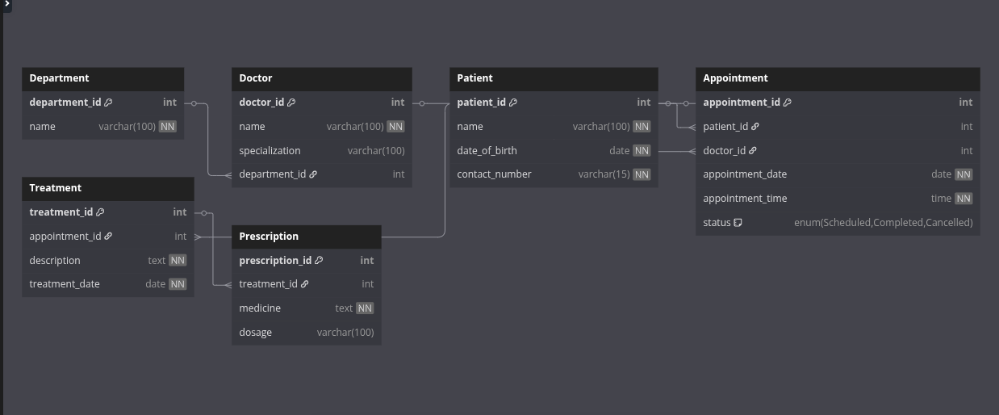

# 🏥 Clinic Booking System - MySQL Database Project

## 📌 Project Title
Clinic Booking System

## 📄 Description
This project is a full-featured **relational database system** designed using **MySQL** to manage bookings, doctors, patients, treatments, and prescriptions for a clinic. It demonstrates core database design principles including:

- Table normalization
- Primary & foreign keys
- One-to-one, one-to-many, and many-to-many relationships
- Data integrity through constraints

## ⚙️ How to Setup / Run the Project

1. Make sure **MySQL Server** is installed and running.
2. Open your MySQL client (e.g., MySQL Workbench, phpMyAdmin, or terminal).
3. Create a new database:
   ```sql
   CREATE DATABASE clinic_db;
## 🧩 Entity Relationship Diagram (ERD)


